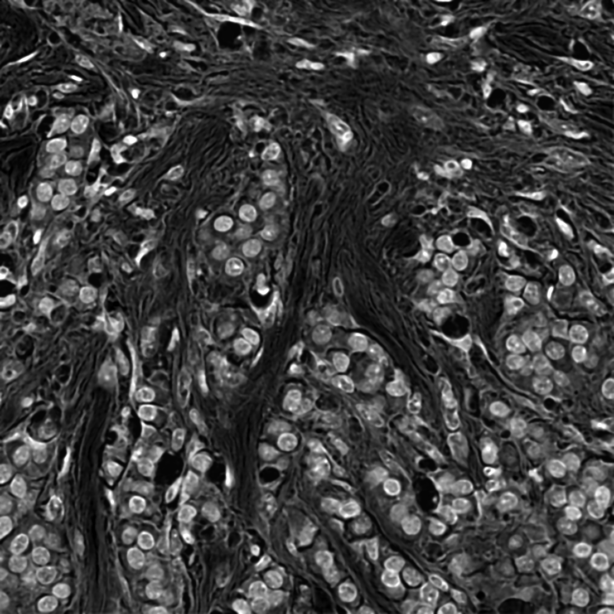

# H&E cell detection

Here, you can find the result of applying cell detection using conventional image processing only, and using conventional image processing + a deep learning model (StarDist).

See the Groovy script for more details about how to replicate the results using QuPath v0.3.2.

## Results

### Original image

Cropped from the [OpenSlide freely-distributable data](https://openslide.org).

### Preprocessed image

Pseudo-fluorescence image, created by applying

* color deconvolution to extract a hematoxylin channel
* a small median filter
* a small Gaussian filter

### StarDist (via QuPath) cell detection

The result of applying a [StarDist model](https://github.com/stardist/stardist) to the pseudo-fluorescence image through [QuPath's StarDist extension](https://github.com/qupath/qupath-extension-stardist).

The model itself was trained by the StarDist authors using training from the [DataScienceBowl 2018](https://www.kaggle.com/c/data-science-bowl-2018).

### QuPath's default cell detection

The result of applying the built-in *Cell detection* from QuPath v0.3.2.
This uses conventional image processing only (no machine learning).

## Purpose

One purpose of this is to illustrate the similarities and differences between deep learning and conventional image processing for cell detection.

A second purpose is to show that a deep learning model trained on different data can sometimes give reasonable results when combined with image processing.

In each case, the detection/image processing parameters were manually adjusted to give reasonable results.

A third purpose, therefore, is for anyone who tries running the code to explore *just how much variation can be achieved* by adjusting parameters, e.g. removing the median or Gaussian filter when generating the pseudo-fluorescence image.
